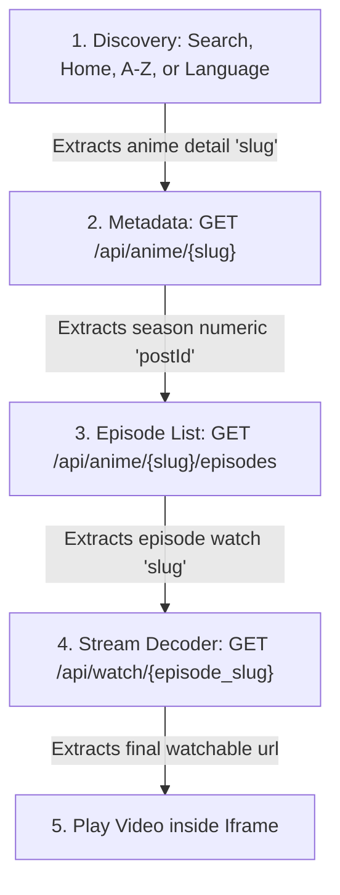

# DesiDubAnime Scraping API

A robust, premium developer-friendly REST API built with FastAPI and Scrapling to scrape, parse, and serve data from `desidubanime.me`. It supports retrieving the home feed, genre listings, A-Z archives, detailed anime metadata, paginated episode lists, search indexes, and fully decoded watch page stream server iframe links (like Filemoon, Streamhide, etc.).

---

## 🚀 Getting Started

### 1. Installation
Install the required dependencies using pip:
```bash
pip install fastapi uvicorn httpx scrapling
```

### 2. Run the Server
Start the API locally using Uvicorn:
```bash
uvicorn api:app --reload
```
The server will run on `http://127.0.0.1:8000`.

---

## 🖥️ Interactive Testing Hubs
* **Root Console Dashboard (`http://127.0.0.1:8000/`)**: A premium developer testing client built directly into the root endpoint. It allows you to select endpoints, pre-fill parameter values, send live requests, and read formatted JSON outputs instantly with syntax highlighting.
* **Swagger Documentation (`http://127.0.0.1:8000/docs`)**: Interactive OpenAPI specification page where you can inspect schemas and test request patterns directly from your browser.

---

## 🔗 Endpoint Interconnection (Pipeline Workflow)
To build a fully functional streaming application, query the endpoints in the following sequence:



### Step 1: Discover Anime (Get `slug`)
Find the anime you want using one of the discovery endpoints:
* **Search:** `GET /api/search/advanced?q=slime`
* **Alphabetical Archive:** `GET /api/az-list?letter=E`
* **Language Tags:** `GET /api/language/tamil`
* **Home Feed:** `GET /api/home`
* *Target Value to extract:* The `"slug"` field (e.g. `"fire-force-2nd-season"`).

### Step 2: Get Season IDs (Get `postId`)
Query the details endpoint:
* `GET /api/anime/fire-force-2nd-season`
* *Target Value to extract:* The `"postId"` (e.g. `"2037"`) or the individual `"season_id"` fields inside the `"seasons"` array.

### Step 3: Fetch Episodes (Get watch `slug`)
Request the episodes list using the season's post ID:
* `GET /api/anime/fire-force-2nd-season/episodes?postId=2037`
* *Target Value to extract:* The `"slug"` of the specific episode you want to watch (e.g. `"enen-no-shouboutai-ni-no-shou-episode-1"`).

### Step 4: Resolve Iframe Links
Pass the watch slug to decode the player iframe links:
* `GET /api/watch/enen-no-shouboutai-ni-no-shou-episode-1`
* *Target Value to extract:* The `"url"` value inside the `"servers"` list (e.g. Filemoon iframe link).

---

## 🗂️ Active Filter Lists

### 1. A-Z List Filters
Valid values to pass to the `?letter=` query parameter in `/api/az-list`:
* Alphabetical letters: `A` to `Z` (case-insensitive)
* Numerical digits: `0-9`
* Special characters: `other`

### 2. Audio Language Slugs
Valid values to pass to the `{slug}` path parameter in `/api/language/{slug}` (obtainable dynamically from `/api/languages`):
* `hindi`
* `tamil`
* `telugu`
* `english`
* `japanese`
* `bengali`
* `malayalam`
* `kannada`

### 3. Anime Genre Slugs
These are the 59 genre filters available on the website (extracted dynamically under `/api/home`):
* `action`, `action-adventure`, `adult-cast`, `adventure`, `animation`, `anthropomorphic`, `award-winning`, `comedy`, `crime`, `crossdressing`, `detective`, `drama`, `ecchi`, `educational`, `family`, `fantasy`, `gag-humor`, `gore`, `harem`, `high-stakes-game`, `historical`, `history`, `horror`, `idols-male`, `isekai`, `love-polygon`, `love-status-quo`, `mecha`, `medical`, `military`, `mystery`, `mythology`, `organized-crime`, `parody`, `psychological`, `reincarnation`, `romance`, `samurai`, `school`, `sci-fi`, `sci-fi-fantasy`, `science-fiction`, `seinen`, `shounen`, `showbiz`, `slice-of-life`, `space`, `sports`, `strategy-game`, `super-power`, `supernatural`, `survival`, `suspense`, `team-sports`, `time-travel`, `urban-fantasy`, `video-game`, `villainess`, `visual-arts`.

---

## 📡 API Endpoints

### 🏠 1. Home Feed
* **Route**: `GET /api/home`
* **Description**: Scrapes and parses the website home page grid feeds.
* **Response Content**:
  * `genres`: Active genre tags list with name and slug.
  * `spotlights`: Featured slides with EN/JP titles, slugs, links, and background banners.
  * `latest_episodes`: Latest released episode card list.
  * `top_airing`, `most_popular`, `completed_series`: Top trending sidebar collections (5 items each).
  * `latest_movies`: Latest grid movie items.
  * `upcoming`: Scheduled/upcoming releases.
  * `popular_today`, `popular_weekly`, `popular_monthly`: Tabbed popular post collections (10 items each).

---

### 🔠 2. A-Z List
* **Route**: `GET /api/az-list`
* **Query Parameters**:
  * `letter` (Required): Single character filter (e.g. `B`, `0-9`, or `other`).

---

### 🗣️ 3. Audio Languages & Tags
* **List All Languages**: `GET /api/languages`
* **Get Language Feed**: `GET /api/language/{slug}`
  * **Path Parameters**:
    * `slug` (Required): The language slug (e.g. `tamil`).
  * **Query Parameters**:
    * `page` (Optional): The page index (defaults to `1`).

---

### ℹ️ 4. Anime Details
* **Route**: `GET /api/anime/{slug}`
* **Path Parameters**:
  * `slug` (Required): The unique anime detail slug (e.g. `fire-force`).

---

### 🎞️ 5. Episodes List
* **Route**: `GET /api/anime/{slug}/episodes`
* **Path Parameters**:
  * `slug` (Required): Anime detail slug.
* **Query Parameters**:
  * `postId` (Required): The **numeric post ID** / `season_id` (e.g., `2037`).
  * `page` (Optional): Page number (defaults to `1`).
  * `order` (Optional): Sort sorting order (`asc` or `desc`).

---

### 📺 6. Streaming Watch Servers (Decoders)
* **Route**: `GET /api/watch/{episode_slug}`
* **Path Parameters**:
  * `episode_slug` (Required): The watch slug of the specific episode (e.g., `enen-no-shouboutai-episode-1`).

---

### 🔍 7. Search Endpoints
* **Instant Search (`GET /api/search/instant`)**:
  * **Query Parameters**:
    * `query` (Required): The keyword (e.g., `slime`).
* **Advanced Search (`GET /api/search/advanced`)**:
  * **Query Parameters**:
    * `q` (Optional): Main search term.
    * `page` (Optional): Page index (defaults to `1`).

---

## ☁️ Cloud Deployment (e.g. Render.com)

When deploying to cloud platforms like Render, the app must bind to `0.0.0.0` (all network interfaces) and listen to the dynamic port assigned via the environment variable `$PORT`.

### Configuration:
In your Render Dashboard, configure the following:
* **Build Command**: `pip install fastapi uvicorn httpx scrapling`
* **Start Command**:
  ```bash
  uvicorn api:app --host 0.0.0.0 --port $PORT
  ```
*(Note: Do not use `--reload` in production environments).*
